# Лабораторная работа №10
## Обработка голоса

### Выбранный вариант: 1. Голосовой диапазон, тембр, форманты

### Что было записано

- `input_audio/a.wav` — протяжный звук `А` от низкого голоса до высокого.
- `input_audio/i.wav` — протяжный звук `И` от низкого голоса до высокого.
- `input_audio/animal.wav` — имитация лая, мяуканья или крик.

Если этих файлов нет, программа создает демонстрационные записи, но для сдачи следует использовать собственный голос.

### Метод анализа

```text
1. WAV переводится в mono.
2. Строится STFT с окном Ханна.
3. Частоты на спектрограмме отображаются в логарифмической шкале.
4. Основной тон F0 оценивается автокорреляцией по коротким окнам.
5. Самый тембрально окрашенный тон ищется по числу выраженных обертонов.
6. Форманты оцениваются как частотные области с максимальной энергией.
   Используется Δt = 0.1 с, Δf = 50 Гц, шаг частоты = 10 Гц.
```

### Сводная таблица

| Запись | Файл | Каналы | Длительность, с | F0 min, Гц | F0 max, Гц | Самый окрашенный F0, Гц | Обертонов |
|:--|:--|--:|--:|--:|--:|--:|--:|
| Гласный А | `a.wav` | 1 | 9.845 | 104.255 | 1225.000 | 1225.000 | 12 |
| Гласный И | `i.wav` | 1 | 8.832 | 108.844 | 1200.000 | 1142.857 | 13 |
| Имитация животного / крик | `animal.wav` | 1 | 6.677 | 83.770 | 1200.000 | 94.862 | 14 |

### Оценка формант

| Запись | F1, Гц | F2, Гц | F3, Гц | Теоретические ориентиры |
|:--|--:|--:|--:|:--|
| Гласный А | 430.0 | 720.0 | 1460.0 | 660, 1700, 2400 |
| Гласный И | 240.0 | 470.0 | 680.0 | 270, 2300, 3000 |
| Имитация животного / крик | 200.0 | 480.0 | 1030.0 | нет |

- CSV со сводкой: `results_lab10/csv/summary.csv`
- CSV с формантами: `results_lab10/csv/formants.csv`
- CSV с энергетическими областями: `results_lab10/csv/energy_regions.csv`

## Гласный А

| Осциллограмма | Спектрограмма |
|:--:|:--:|
| 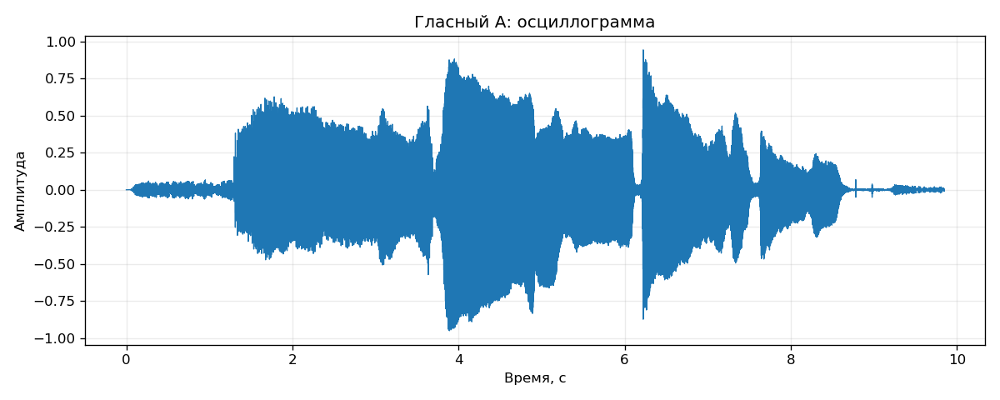 | 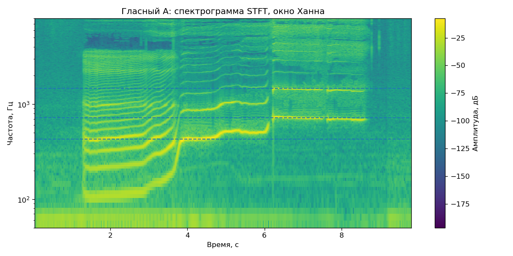 |

| Основной тон | Усредненный спектр |
|:--:|:--:|
| 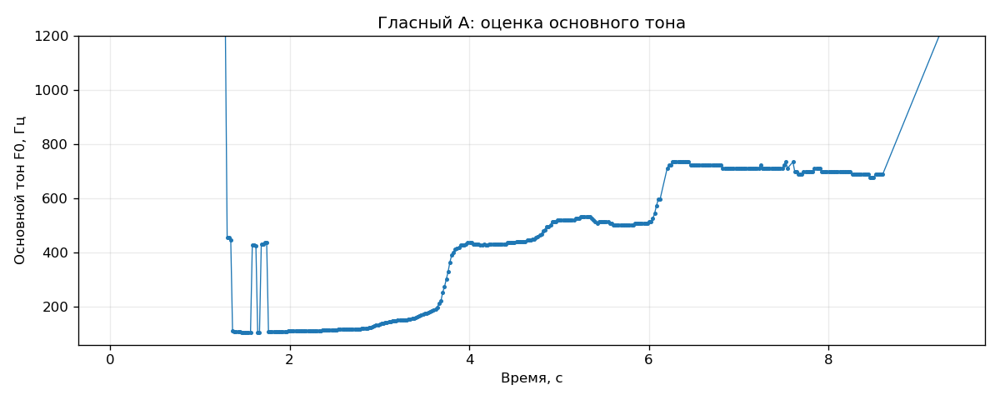 | 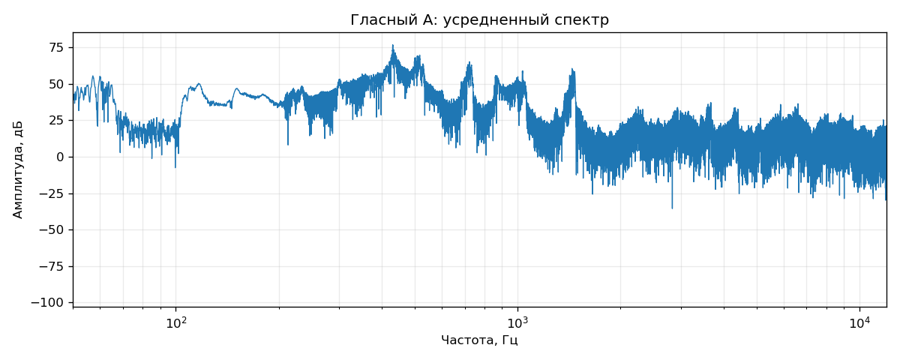 |

### Топ-5 энергетических областей

| Ранг | t0, c | t1, c | f0, Гц | f1, Гц | Энергия |
|---:|---:|---:|---:|---:|---:|
| 1 | 3.900 | 4.000 | 400.0 | 450.0 | 1.344525e+00 |
| 2 | 4.200 | 4.300 | 400.0 | 450.0 | 9.303779e-01 |
| 3 | 4.000 | 4.100 | 400.0 | 450.0 | 8.398508e-01 |
| 4 | 4.100 | 4.200 | 400.0 | 450.0 | 8.218258e-01 |
| 5 | 4.300 | 4.400 | 400.0 | 450.0 | 6.870379e-01 |

## Гласный И

| Осциллограмма | Спектрограмма |
|:--:|:--:|
| 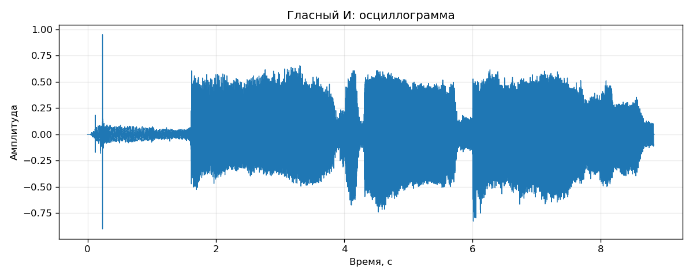 | 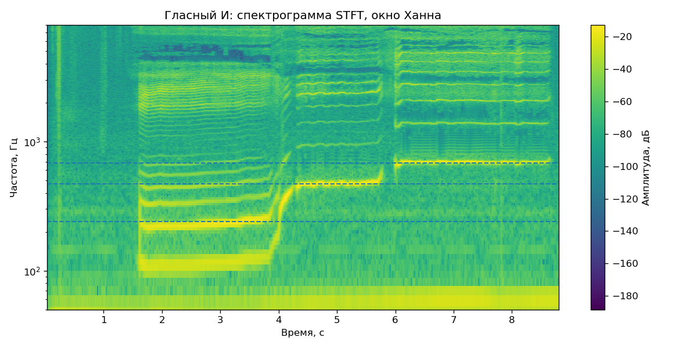 |

| Основной тон | Усредненный спектр |
|:--:|:--:|
| 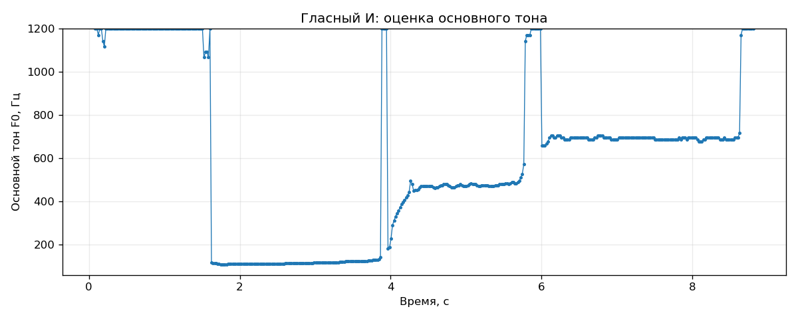 | 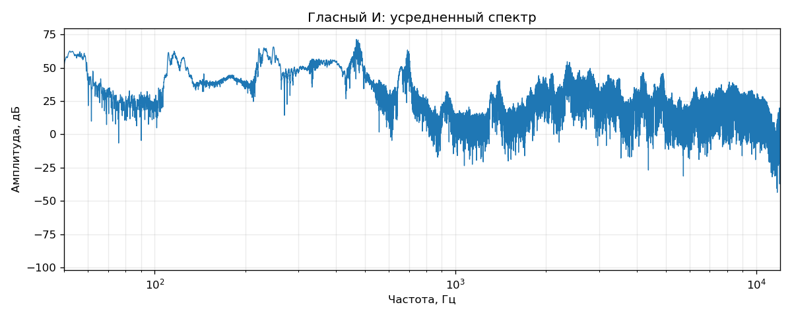 |

### Топ-5 энергетических областей

| Ранг | t0, c | t1, c | f0, Гц | f1, Гц | Энергия |
|---:|---:|---:|---:|---:|---:|
| 1 | 4.100 | 4.200 | 350.0 | 400.0 | 3.616548e-01 |
| 2 | 4.500 | 4.600 | 450.0 | 500.0 | 3.283439e-01 |
| 3 | 4.600 | 4.700 | 450.0 | 500.0 | 3.030014e-01 |
| 4 | 4.700 | 4.800 | 450.0 | 500.0 | 2.660876e-01 |
| 5 | 4.400 | 4.500 | 450.0 | 500.0 | 2.303083e-01 |

## Имитация животного / крик

| Осциллограмма | Спектрограмма |
|:--:|:--:|
| 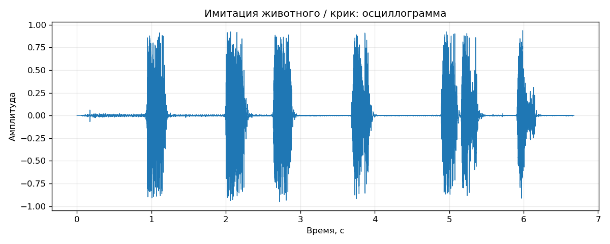 | 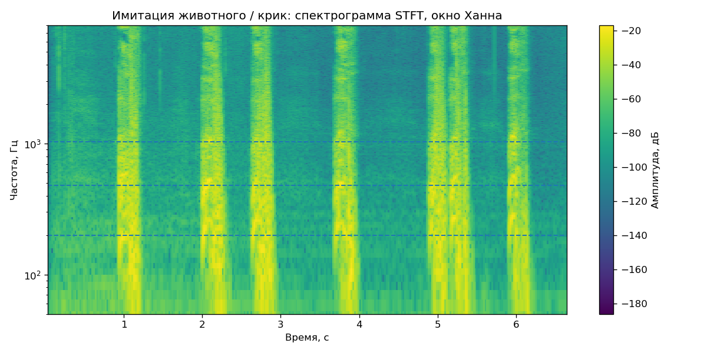 |

| Основной тон | Усредненный спектр |
|:--:|:--:|
| 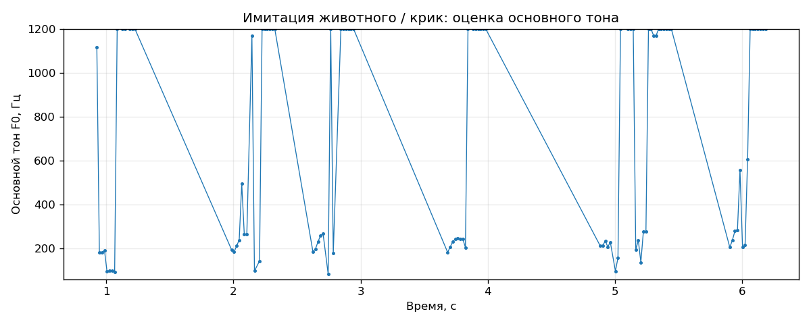 | 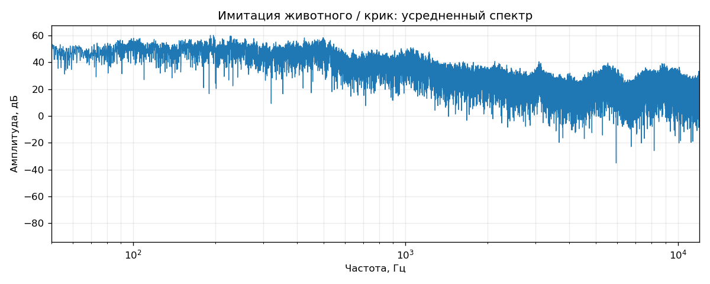 |

### Топ-5 энергетических областей

| Ранг | t0, c | t1, c | f0, Гц | f1, Гц | Энергия |
|---:|---:|---:|---:|---:|---:|
| 1 | 2.000 | 2.100 | 500.0 | 550.0 | 9.577071e-02 |
| 2 | 3.700 | 3.800 | 450.0 | 500.0 | 7.936042e-02 |
| 3 | 2.000 | 2.100 | 450.0 | 500.0 | 7.658923e-02 |
| 4 | 2.700 | 2.800 | 150.0 | 200.0 | 7.517943e-02 |
| 5 | 2.000 | 2.100 | 400.0 | 450.0 | 7.095514e-02 |

